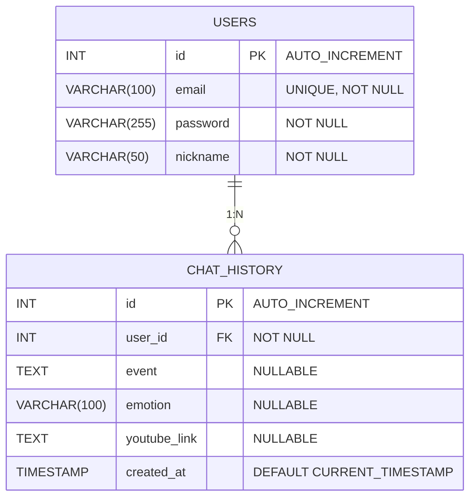

<p align="center">
  <h1 align="center">Emotion-Based Music Recommendation Chatbot</h1>
</p>

<p align="center">
  PHP · Docker · MariaDB · Chart.js 기반 감정 분석 음악 추천 웹 서비스
</p>

<p align="center">
  
  
  
  
</p>

---

## Project Overview

본 프로젝트는 사용자가 입력한 상황 설명 텍스트를 기반으로  
사전 정의된 감정 분류 규칙을 적용하여,  
해당 감정에 맞는 음악 플레이리스트를 자동 추천하는 **웹 기반 챗봇 서비스**입니다.

Docker 기반 환경에서 PHP 웹 서버와 MariaDB를 분리 구성하여
실제 서비스 배포 구조와 유사한 형태로 시스템을 설계하였으며,  
감정 기록 저장, 통계 시각화, 로그인 세션 관리까지 포함한 **풀스택 구조 실습 프로젝트**입니다.

---

## Why This Project

단순 챗봇 구현을 넘어,  
실제 웹 서비스 형태로 사용자 입력 → 처리 로직 → DB 저장 → 시각화 → 추천 결과 제공까지  
전체 데이터 흐름을 직접 설계하고 구현하는 것을 목표로 진행했습니다.

특히 서버 환경 구성, 컨테이너 기반 배포 구조, 세션 인증,  
데이터베이스 설계 경험을 동시에 확보하는 것을 중점으로 개발했습니다.

---

## Technical Highlights

| Area | Description |
------|------
**Service Architecture** | Docker Compose 기반 PHP · MariaDB · phpMyAdmin 멀티 컨테이너 구성  
**Authentication** | PHP Session 기반 로그인 / 회원가입 시스템 구현  
**Data Storage** | 사용자 대화 기록 및 감정 로그 영속 저장  
**Rule-based NLP Logic** | 키워드 매칭 기반 감정 분류 및 검색어 자동 매핑  
**Visualization** | Chart.js 기반 감정 통계 대시보드 구현  
**External Access Test** | ngrok + QR 코드 기반 모바일 외부 접속 테스트  

---

## Project Structure

```bash
.
├── docker-compose.yml        # 전체 서비스 컨테이너 오케스트레이션
│                             # docker-compose.yml을 통해 PHP 웹 서버, MariaDB, phpMyAdmin 컨테이너를 동시에 실행하도록 구성되어 있습니다.
├── LICENSE
├── README.md
├── analyer.py                # (실험용) 감정 분석 스크립트
│
├── ai/                       # AI 실험 코드 (현재 서비스 미사용)
│   ├── Dockerfile.txt
│   └── analyer.py
│
├── db/                       # MariaDB 컨테이너 및 초기화 스크립트
│   ├── Dockerfile
│   └── init.sql
│
├── web/                      # PHP 웹 애플리케이션
│   ├── Dockerfile
│   ├── index.php             # 메인 챗봇 UI
│   ├── chatbot.php           # 감정 분석 + 추천 처리
│   ├── emotion_stats.php     # 감정 통계 대시보드
│   ├── functions.php         # 공통 함수 / DB 연결
│   ├── login.php             # 로그인 처리
│   ├── logout.php            # 로그아웃
│   ├── register.php          # 회원가입
│   ├── register_success.php  # 회원가입 완료 페이지
│   └── style.css             # UI 스타일
│
└── images/                   # README 및 UI 스크린샷
    ├── chatbot.png
    ├── emotion_stat.png
    ├── login.png
    ├── register.png
    ├── playlist.png
    ├── DB_history.png
    ├── DB_users.png
    └── qr.png
```

---

## System Architecture
본 프로젝트는 Docker Compose 기반 멀티 컨테이너 구조로 구성되어 있으며
웹 서버, 데이터베이스, 관리 도구를 역할별로 분리하여 운영합니다.

- **Web Server**: PHP + Apache  
- **Database**: MariaDB  
- **Container Orchestration**: Docker Compose  
- **Visualization**: Chart.js  
- **Admin Tool**: phpMyAdmin

```
                ┌───────────────────────┐
                │        Browser         │
                │   (User / Mobile)      │
                └───────────┬───────────┘
                            │ HTTP (8080)
                            ▼
                ┌───────────────────────┐
                │   PHP + Apache Server  │
                │       (web)            │
                │ - Chatbot UI           │
                │ - Emotion Logic        │
                │ - Session Auth         │
                │ - Chart Dashboard      │
                └───────────┬───────────┘
                            │ PDO / SQL
                            ▼
                ┌───────────────────────┐
                │        MariaDB         │
                │         (db)           │
                │ - users table          │
                │ - chat_history table  │
                └───────────┬───────────┘
                            │
            Admin Access     │
         (8081 phpMyAdmin)   ▼
                ┌───────────────────────┐
                │       phpMyAdmin       │
                │    (DB Management)     │
                └───────────────────────┘
```

### Architecture Description

1. Browser (Client)
   - 사용자가 웹 인터페이스를 통해 텍스트 입력 및 추천 결과를 확인합니다.

2. PHP + Apache (Web Container)
  - 챗봇 UI 렌더링, 감정 분류 로직 처리, 세션 기반 인증 관리, DB 요청 및 통계 데이터 가공을 담당합니다.

3. MariaDB (Database Container)
  - 사용자 계정 정보, 감정 기록, 추천 로그 데이터를 영속 저장합니다.

4. phpMyAdmin (Admin Tool)
  - 웹 기반 DB 관리 도구로 개발 및 디버깅 과정에서 테이블 상태를 관리합니다.

### Container Orchestration

모든 서비스는 docker-compose.yml을 통해 한 번에 실행되며
각 컨테이너는 독립적으로 동작하면서 내부 Docker Network를 통해 통신합니다.

```
docker-compose up --build
```

### External Access Test (Optional)

ngrok을 활용하여 로컬 서버를 외부에서 접근 가능하도록 구성하고
QR 코드를 통해 모바일 환경 테스트도 수행했습니다.

```
  Browser (Mobile)
        ↓
     ngrok Tunnel
        ↓
 PHP Web Server (Docker)
```

---

## Emotion Classification Logic

본 시스템은 AI 모델 대신 사전 정의된 키워드 매칭 규칙 기반으로 감정을 분류합니다.

| Emotion | Example Keywords | YouTube Search Query |
--------|----------------|-------------------
분노 | 화나, 짜증, 빡쳐 | 화났을 때 듣는 노래 플레이리스트  
슬픔 | 우울, 슬퍼, 눈물 | 우울할 때 듣는 노래 플레이리스트  
외로움 | 외로워, 혼자, 쓸쓸 | 외로울 때 듣는 노래 플레이리스트  
불안 | 불안, 초조, 긴장 | 불안할 때 듣는 노래 플레이리스트  
걱정 | 걱정돼, 고민 | 걱정될 때 듣는 노래 플레이리스트  
사랑 | 사랑해, 설레 | 사랑에 빠졌을 때 듣는 노래 플레이리스트  
기쁨 | 행복해, 신나 | 신나는 노래 플레이리스트  

---

## Database Schema

본 프로젝트는 사용자 인증, 대화 기록 저장, 감정 통계 분석 기능을 고려하여  
관계형 구조 기반으로 다음 두 개의 핵심 테이블로 설계되었습니다.


### users (사용자 계정 테이블)

| 컬럼명 | 타입 | 제약조건 | 설명 |
|-------|------|---------|------|
id | INT | PK, AUTO_INCREMENT | 내부 사용자 고유 ID |
email | VARCHAR(100) | UNIQUE, NOT NULL | 로그인 계정 이메일 |
password | VARCHAR(255) | NOT NULL | 해시 처리된 비밀번호 |
nickname | VARCHAR(50) | NOT NULL | 서비스 표시용 닉네임 |


### chat_history (대화 및 감정 기록 테이블)

| 컬럼명 | 타입 | 제약조건 | 설명 |
|-------|------|---------|------|
id | INT | PK, AUTO_INCREMENT | 대화 기록 고유 번호 |
user_id | INT | FK, NOT NULL | users 테이블 참조 |
event | TEXT | NULL 허용 | 사용자가 입력한 상황 텍스트 |
emotion | VARCHAR(100) | NULL 허용 | 분류된 감정 라벨 |
youtube_link | TEXT | NULL 허용 | 추천된 유튜브 플레이리스트 링크 |
created_at | TIMESTAMP | DEFAULT CURRENT_TIMESTAMP | 기록 생성 시각 |


### 테이블 관계 (Relationship)

- `users.id` **1 : N** `chat_history.user_id`  
- 하나의 사용자는 여러 개의 대화 기록을 가질 수 있도록 설계


### 인덱스 및 제약조건 설계 포인트

- `users.email`  
  → UNIQUE 제약조건 적용으로 로그인 중복 방지 및 조회 성능 개선  

- `chat_history.user_id`  
  → Foreign Key 적용으로 사용자-기록 간 참조 무결성 유지  

- `created_at`  
  → DEFAULT CURRENT_TIMESTAMP 적용으로 자동 시간 기록 처리  

---

## erDiagram

---

## Screenshots

### Authentication

| Login | Register |
|------|--------|
|  |  |

### DB

| DB USER | DB History |
|------|--------|
|  |  |


### Chatbot Interface

<p align="center">
  
</p>


### Emotion Statistics Dashboard

<p align="center">
  
</p>

### Playlist Recommendation

<p align="center">
  
</p>

### QR
**해당 QR은 발표 당시 시연을 위한 임시 QR로 현재는 동작하지 않습니다.**
<p align="center">
  
</p>

--

## Getting Started

### 1. Clone Repository
```bash
git clone https://github.com/OhJisong/Linix-project_Rule-based-chatbot.git
cd Linix-project_Rule-based-chatbot
```

### 2. Run Docker Containers
```bash
docker-compose up --build
```

### 3. Access Web Service
```bash
http://localhost:8080
```

**phpmyadmin**
```bash
http://localhost:8081
```

---

## What I Learned

Docker Compose 기반 멀티 컨테이너 웹 서비스 구성 경험

PHP 세션 기반 인증 시스템 구현

감정 로그 데이터 저장 및 통계 시각화 파이프라인 구축

Rule-based 텍스트 처리 로직 설계

실제 서비스 흐름에 가까운 웹 애플리케이션 구조 설계

---

## Future Improvements

REST API 구조로 백엔드 분리

OAuth 기반 소셜 로그인 연동

AI 기반 감정 분류 모델 적용

추천 결과 개인화 알고리즘 고도화

서비스 로그 및 사용자 행동 분석 기능 추가

---

## Note

본 프로젝트는 학습 목적의 웹 서비스 실습 프로젝트이며,
실제 배포 환경과 유사한 구조 설계 및 데이터 흐름 구현을 목표로 개발되었습니다.
